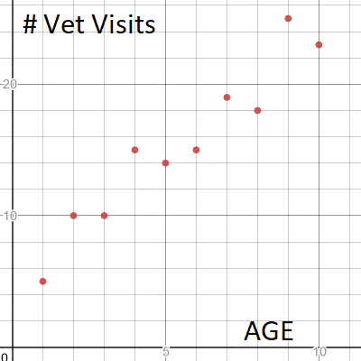
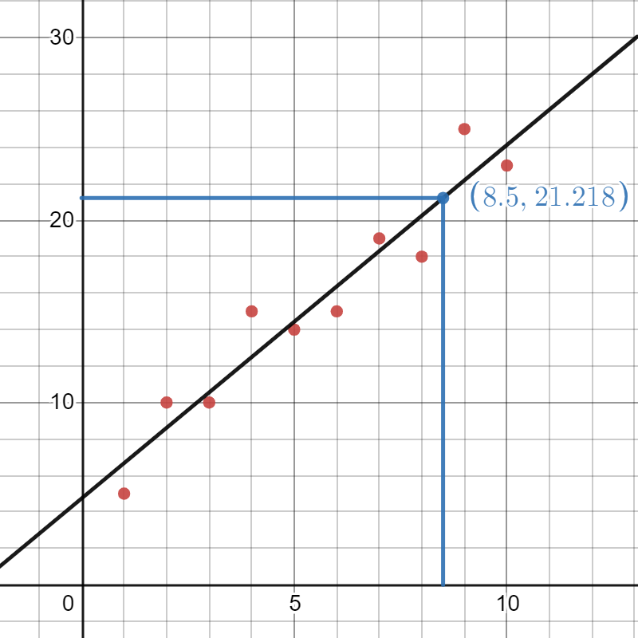

# Linear Regression

Linear regression is basically fitting the given data points into a line. The line is defined by the equation $y = mx + c$ where $m$ is the slope of the line and $c$ is the y-intercept. The goal of linear regression is to find the best fit line for the given data points.

## Simple Linear Regression

For understanding, let's set up a problem

I want a relation between the age of the dog and the number of veterinary visits it had.
The data I have is as follows:

We can clearly see a linear relation between the age of the dog and the number of veterinary visits it had. We can fit a line to this data and predict the number of veterinary visits for a given age.

> More info in the [notebook](/code/regression/regression.ipynb)

## Closed Form Solution

Now, the luxury of having a closed form solution into which we can just substitute the values and get the equation of the line is only available for simple linear regression. For multiple linear regression, we have to use gradient descent to find the best fit line.

The closed form solution for simple linear regression is as follows:

$$
m = \frac{n\sum{xy} - \sum{x}\sum{y}}{n\sum{x^2} - (\sum{x})^2}
$$

$$
c = \frac{\sum{y} - m\sum{x}}{n}
$$

where $n$ is the number of data points, $x$ is the age of the dog and $y$ is the number of veterinary visits.

From here on, m and c will be replaced by $\beta_1$ and $\beta_0$ respectively. So, the equation of the line becomes:

$$
y = \beta_1x + \beta_0
$$

### Inverse Matrix Techniques

Regression can be solved using inverse matrix techniques. The equation of the line can be written as:

$$
\beta_1 = (X^TX)^{-1}X^Ty
$$

where $X$ is the matrix of the independent variables and $y$ is the vector of the dependent variable.
$$

X = \begin{bmatrix}
1 & x_1 \\
1 & x_2 \\
\vdots & \vdots \\
1 & x_n
\end{bmatrix}

y = \begin{bmatrix}
y_1 \\
y_2 \\
\vdots \\
y_n
\end{bmatrix}
$$

Now, $\beta_0$ can be calculated as follows:

$$
\beta_0 = \bar{y} - \beta_1\bar{x}
$$

where $\bar{y}$ is the mean of the dependent variable and $\bar{x}$ is the mean of the independent variable.

## Gradient Descent

Gradient descent is an iterative optimization algorithm that is used to find the minimum of a function. In our case, the function is the cost function.

> Refer to the [notebook](/code/regression/regression.ipynb) for code implementation.

We basically calculate the slope of the cost function at a given point and move in the direction opposite to the slope. This is done iteratively until we reach the minimum of the cost function.